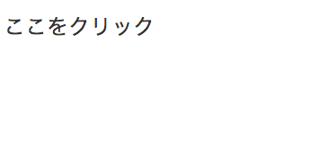
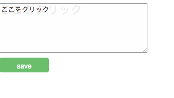
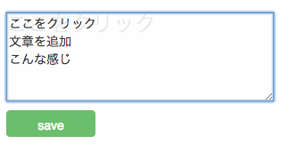
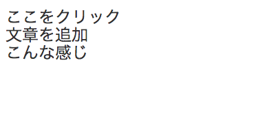

## このリポジトリについて

[フロントエンドJavaScriptにおける設計とテスト](http://hokaccha.github.io/slides/javascript_design_and_test/)というとてもわかりやすいスライドがあります。

それを実際に写経しながら、jQueryベースのよくあるようなJavaScriptのリファクタリングをしてみました。

## サンプルアプリ

以下のような文書が表示されてます



**ここをクリック**の文字をクリックすると**元の文字が含まれた状態で**編集画面になります。



文章を編集します



saveボタンをクリックすると入力された文字が**改行付**きで画面に反映されます



## ベースとなるHTML/JavaScriptについて

### HTMLについて

```html
<!DOCTYPE html>
<html>

  <head>
    <link data-require="bootstrap@*" data-semver="3.2.0" rel="stylesheet" href="https://maxcdn.bootstrapcdn.com/bootstrap/3.2.0/css/bootstrap.css" />
    <link data-require="bootstrap-css@*" data-semver="3.3.1" rel="stylesheet" href="//maxcdn.bootstrapcdn.com/bootstrap/3.3.1/css/bootstrap.min.css" />
    <script data-require="bootstrap@*" data-semver="3.2.0" src="https://maxcdn.bootstrapcdn.com/bootstrap/3.2.0/js/bootstrap.js"></script>
    <script data-require="backbone.js@*" data-semver="1.1.2" src="http://backbonejs.org/backbone-min.js"></script>
    <script data-require="underscore.js@*" data-semver="1.6.0" src="//cdnjs.cloudflare.com/ajax/libs/underscore.js/1.6.0/underscore-min.js"></script>
    <script data-require="jquery@*" data-semver="2.1.1" src="//cdnjs.cloudflare.com/ajax/libs/jquery/2.1.1/jquery.min.js"></script>
    <link rel="stylesheet" href="style.css" />
    <script src="main.js"></script>
  </head>

  <body>
  <div class="container-fluid">
    <div class="row">
      <div class="col-md-8">
        <h3 id="subTitle">ここをクリック</h3>
      </div>
      <div class="col-md-4"></div>
    </div>
    </div>
  </body>
</html>
```

### JavaScriptについて

上記HTMLで読み込んでいるJavaScriptは、jQueryベースのコードになります。

処理のポイントになる所を以下まとめてます。（数字とソースコード本文中のコメントの数字を対応させてますのでそれらを参照しながら読み進めてください）

1. id属性がsubTitleがクリックされた時の処理をこの行以降で定義してます
2. クリックした要素の上にテキストエリアを重なるように表示するために現在の要素のoffset()の値を取得してます
3. jQueryの機能を使って動的にテキストエリアの要素を生成します
4. this.innerHTML.replace(/<br\/?>/g, '\n')にてテキストエリアに表示したい文字列を取得してます
5. 動的に生成したsaveボタンのクリックイベントをこれ以降の行で設定してます
6. テキストエリア内に入力された文字で改行が含まれることを想定して、改行コードを、HTMLのBRに置換します
7. 上記６．で置換した文字列で、元々表示してあったテキスト要素を置換します
8. 動的に生成したテキストエリアとsaveボタンを現在表示してるHTMLのBodyタグないに挿入します

```javascript
$(document).ready(function() {
  $("#subTitle").click(function(e){    // (1)
    var textarea, savebutton ,offset;
    offset = $(this).offset();         // (2)
    textarea = $('<textarea>').css({   // (3)
      display: 'block',
      position: 'absolute',
      left: offset.left,
      top: offset.top,
      width: 300,
      height: 100,
      fontSize: 14,
      fontFamily: "'Open Sans', Helvetica, Arial, sans-serif",
      zIndex: 1,
      background: 'rgba(255,255,255,0.9)'
    }).val(this.innerHTML.replace(/<br\/?>/g, '\n'));  // (4)
    
    savebutton = $('<div id="save" class="btn">').css({
      display: 'block',
      position: 'absolute',
      left: offset.left,
      top: offset.top + 110,
      width: 100,
      height: 30,
      fontSize: 14,
      fontFamily: "'Open Sans', Helvetica, Arial, sans-serif",
      zIndex: 1,
      background: 'rgba(92,184,92,0.9)',
      color: '#f9f9f9',
      cursor: 'pointer'
    }).text('save');
    savebutton.on('click', function() {               // (5) 
      var val;
      val = textarea.val().replace(/\n/g, '<br>');    // (6)
      textarea.remove();
      this.remove();
      $("#subTitle").html(val);                       // (7)
      return;
    });
    $('body').append(savebutton);                     // (8) 
    $('body').append(textarea);                       // (9) 
    return;
  });
});
```
